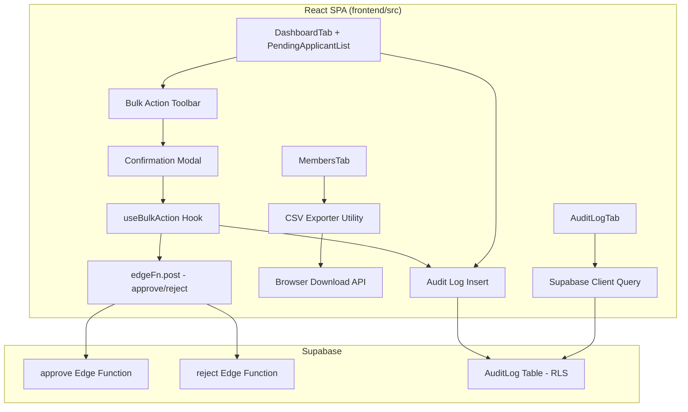

# Design Document: Admin Operations

## Overview

This feature introduces three operational enhancements to the SBG Admin Portal: bulk approve/reject for pending applicants, CSV export of the filtered member list, and a persistent audit log. These capabilities address pain points during high-volume recruitment periods by enabling batch processing, offline data analysis, and full traceability of admin decisions.

The implementation is entirely client-side for CSV generation, leverages existing Supabase Edge Functions for bulk operations (calling them sequentially via `Promise.allSettled`), and adds a new PostgreSQL table with RLS for audit logging via the Supabase JS client.

## Architecture



**Key architectural decisions:**

1. **Sequential Edge Function calls via `Promise.allSettled`**: Bulk operations call existing `approve`/`reject` Edge Functions in parallel using `Promise.allSettled`. This reuses existing server-side logic (SBG ID assignment, email triggers) without creating new endpoints. The trade-off is slightly higher latency for large batches, but it preserves atomicity per member and provides granular error reporting.

2. **Client-side CSV generation**: The CSV export fetches all matching members (bypassing pagination) via a Supabase query, then generates the CSV string in-browser and triggers a download via `Blob` + `URL.createObjectURL`. No server-side processing needed.

3. **Client-side audit log inserts**: The authenticated admin inserts audit log entries directly via the Supabase JS client. RLS ensures only authenticated users can INSERT and SELECT — anon has no access. This avoids creating additional Edge Functions for a simple insert operation.

## Components and Interfaces

### New Components

| Component | Location | Purpose |
|---|---|---|
| `BulkActionToolbar` | `components/admin/BulkActionToolbar.tsx` | Contextual toolbar with selection count, approve/reject buttons |
| `ConfirmationModal` | `components/ui/ConfirmationModal.tsx` | Reusable confirm/cancel dialog for destructive actions |
| `AuditLogTab` | `components/admin/tabs/AuditLogTab.tsx` | Admin tab displaying audit log timeline with filters |
| `AuditLogEntry` | `components/admin/AuditLogEntry.tsx` | Single audit log entry card with badge, actor, target, timestamp |

### New Utilities / Hooks

| Module | Location | Purpose |
|---|---|---|
| `useBulkAction` | `lib/useBulkAction.ts` | Hook managing bulk operation state (progress, results, errors) |
| `csvExporter` | `lib/csvExporter.ts` | Pure functions: `formatCsvRow`, `escapeCsvField`, `generateCsv`, `triggerDownload` |
| `auditLog` | `lib/auditLog.ts` | Helper functions to insert audit log entries with typed payloads |

### New Types

```typescript
// types/index.ts (additions)

export type AuditActionType =
  | 'approve'
  | 'reject'
  | 'bulk_approve'
  | 'bulk_reject'
  | 'announcement_sent'
  | 'registration_toggled'
  | 'term_reset'

export interface AuditLogEntry {
  id: string
  action_type: AuditActionType
  actor_email: string
  actor_id: string
  target_member_id: string | null
  target_member_name: string | null
  details: Record<string, unknown> | null
  created_at: string
}

export interface BulkOperationResult {
  total: number
  succeeded: number
  failed: number
  errors: { memberId: string; memberName: string; error: string }[]
}
```

### Modified Components

| Component | Changes |
|---|---|
| `PendingApplicantList` | Add checkbox column, row selection state, header checkbox, pass selection up |
| `DashboardTab` | Integrate `BulkActionToolbar`, manage selection state, wire bulk actions + audit log inserts |
| `MembersTab` | Add "Export CSV" button, wire to `csvExporter` |
| `AdminSidebar` | Add "Audit Log" nav item with `ClipboardList` icon |
| `App.tsx` (routes) | Add `/admin/audit-log` route pointing to `AuditLogTab` |

### Interface Contracts

```typescript
// useBulkAction hook
interface UseBulkActionOptions {
  action: 'approve' | 'reject'
  memberIds: string[]
  memberNames: Map<string, string> // id -> name for audit log
  onComplete: () => void // refresh callback
}

interface UseBulkActionReturn {
  execute: () => Promise<BulkOperationResult>
  isRunning: boolean
  progress: { completed: number; total: number }
}

// csvExporter
function escapeCsvField(value: string): string
function generateCsv(members: Member[]): string
function triggerDownload(csvContent: string, filename: string): void

// auditLog
function insertAuditLog(entry: Omit<AuditLogEntry, 'id' | 'created_at'>): Promise<void>
```

## Data Models

### AuditLog Table (New)

```sql
-- database/003_audit_log.sql

CREATE TABLE "AuditLog" (
  id                  UUID          PRIMARY KEY DEFAULT gen_random_uuid(),
  action_type         TEXT          NOT NULL,
  actor_email         TEXT          NOT NULL,
  actor_id            UUID          NOT NULL,
  target_member_id    UUID          REFERENCES "Member"(id) ON DELETE SET NULL,
  target_member_name  TEXT,
  details             JSONB,
  created_at          TIMESTAMPTZ   NOT NULL DEFAULT now()
);

-- Indexes for common query patterns
CREATE INDEX idx_audit_log_action_type ON "AuditLog" (action_type);
CREATE INDEX idx_audit_log_created_at  ON "AuditLog" (created_at DESC);
CREATE INDEX idx_audit_log_actor       ON "AuditLog" (actor_id);

-- RLS: authenticated can INSERT and SELECT, anon has no access
ALTER TABLE "AuditLog" ENABLE ROW LEVEL SECURITY;

CREATE POLICY "Authenticated users can insert audit logs"
  ON "AuditLog" FOR INSERT
  TO authenticated
  WITH CHECK (true);

CREATE POLICY "Authenticated users can read audit logs"
  ON "AuditLog" FOR SELECT
  TO authenticated
  USING (true);
```

### Details JSONB Structure by Action Type

| action_type | details shape |
|---|---|
| `approve` | `null` (target_member_id/name are sufficient) |
| `reject` | `null` |
| `bulk_approve` | `{ "count": N, "member_ids": ["uuid1", ...] }` |
| `bulk_reject` | `{ "count": N, "member_ids": ["uuid1", ...] }` |
| `announcement_sent` | `{ "subject": "...", "recipient_count": N }` |
| `registration_toggled` | `{ "new_state": "open" | "closed" }` |
| `term_reset` | `null` |

### CSV Export Columns

The exported CSV includes exactly these columns in this order:

```
full_name, student_number, email, course, year_level, section, status, sbg_id, school_year, created_at
```

## Correctness Properties

*A property is a characteristic or behavior that should hold true across all valid executions of a system — essentially, a formal statement about what the system should do. Properties serve as the bridge between human-readable specifications and machine-verifiable correctness guarantees.*

### Property 1: Selection state consistency

*For any* list of visible members and any sequence of individual checkbox toggles, the selection set SHALL contain exactly those member IDs whose checkboxes are in the checked state. Additionally, checking the header checkbox SHALL produce a selection set equal to the full visible member ID set, and unchecking it SHALL produce an empty selection set.

**Validates: Requirements 1.3, 1.4, 1.5**

### Property 2: Toolbar count matches selection size

*For any* non-empty selection set of size N, the Bulk Action Toolbar SHALL display the text "{N}" as the selected count. When the selection set is empty, the toolbar SHALL not be rendered.

**Validates: Requirements 1.6, 1.7**

### Property 3: Confirmation modal displays correct count

*For any* bulk action (approve or reject) with N selected applicants, when the action button is clicked, the confirmation modal message SHALL contain the number N and the action name ("Approve" or "Reject").

**Validates: Requirements 2.2, 3.2**

### Property 4: Bulk operation invokes Edge Function for each selected member

*For any* set of K selected member IDs, when a bulk operation (approve or reject) is confirmed, the system SHALL invoke the corresponding Edge Function exactly K times — once per member ID. The set of IDs passed to the Edge Function calls SHALL equal the original selection set.

**Validates: Requirements 2.3, 3.3**

### Property 5: Bulk operation result toast reports correct counts

*For any* bulk operation of N members where S succeed and F fail (S + F = N), the system SHALL display a success toast containing S if S > 0, and an error toast containing F if F > 0. The sum of reported successes and failures SHALL equal N.

**Validates: Requirements 2.5, 2.6, 3.5, 3.6**

### Property 6: CSV column format and header correctness

*For any* non-empty array of Member objects, the generated CSV string SHALL have as its first line a header row with exactly 10 comma-separated field names: "full_name,student_number,email,course,year_level,section,status,sbg_id,school_year,created_at". Each subsequent line SHALL contain exactly 10 fields corresponding to the member's data.

**Validates: Requirements 4.3, 4.4**

### Property 7: CSV field escaping round-trip (RFC 4180)

*For any* string value containing commas, double quotes, or newline characters, applying `escapeCsvField` then parsing the result according to RFC 4180 rules SHALL yield the original string value.

**Validates: Requirements 4.5**

### Property 8: Audit log entry correctness

*For any* admin action (approve, reject, bulk_approve, bulk_reject, announcement_sent, registration_toggled, term_reset) with associated parameters, the inserted audit log entry SHALL have: (a) `action_type` matching the performed action, (b) `actor_email` and `actor_id` matching the authenticated admin, (c) `target_member_id` and `target_member_name` set for single-member actions, (d) `details` containing the expected structured data for bulk/announcement/toggle actions.

**Validates: Requirements 5.3, 5.4, 5.5, 5.6, 5.7**

### Property 9: Audit log display order

*For any* set of audit log entries with distinct `created_at` timestamps, the Audit Log Tab SHALL display them in strictly descending order by `created_at` (newest first).

**Validates: Requirements 6.2**

### Property 10: Audit log entry renders all required fields

*For any* audit log entry, the rendered component SHALL display the action type as a badge, the actor email, the target member name (when non-null), the formatted timestamp, and a details summary (when details is non-null).

**Validates: Requirements 6.3**

## Error Handling

| Scenario | Behavior |
|---|---|
| Single Edge Function call fails during bulk operation | `Promise.allSettled` captures the rejection. The operation continues for remaining members. Final toast reports failure count. |
| Network timeout during bulk operation | Same as above — individual promise rejects, others continue. |
| CSV export query fails | Display error toast "Failed to export members". Re-enable button. |
| CSV export returns empty data | Display info toast "No members to export". No file generated. |
| Audit log INSERT fails | Log to console. Do NOT block the primary action (approve/reject should still succeed). Display warning toast only if in development mode. |
| Supabase session expired during bulk operation | First failed call returns 401. Subsequent calls will also fail. Error toast shows failure count. User prompted to re-authenticate on next navigation. |
| AuditLog query fails (tab) | Display error state in tab with retry button, consistent with other tabs. |

## Testing Strategy

### Unit Tests (Example-based)

- **ConfirmationModal**: Renders with message, calls onConfirm/onCancel correctly
- **BulkActionToolbar**: Visible/hidden based on selection, buttons disabled during operation
- **AuditLogTab**: Renders filter controls, pagination, loading state
- **triggerDownload**: Creates blob URL and triggers anchor click (mocked)
- **Edge cases**: Empty selection, empty member list for export, null fields in audit entries

### Property-Based Tests (fast-check)

Property-based testing is appropriate here because several core utilities are pure functions with clear input/output behavior (CSV escaping, selection logic, audit log entry construction) and the behavior varies meaningfully across a wide input space.

**Library**: [fast-check](https://github.com/dubzzz/fast-check) (TypeScript PBT library)
**Configuration**: Minimum 100 iterations per property
**Tag format**: `Feature: admin-operations, Property {N}: {title}`

Properties to implement:
1. Selection state consistency (Property 1)
2. Toolbar count matches selection (Property 2)
3. Confirmation modal count (Property 3)
4. Bulk operation call count (Property 4)
5. Result toast reporting (Property 5)
6. CSV format correctness (Property 6)
7. CSV escaping round-trip (Property 7)
8. Audit log entry correctness (Property 8)
9. Audit log display order (Property 9)
10. Audit log entry rendering (Property 10)

### Integration Tests

- Bulk approve with mocked Edge Functions: verify full flow from selection → confirm → calls → refresh
- CSV export with mocked Supabase: verify query bypasses pagination, generates correct file
- Audit log tab with mocked data: verify filtering and pagination queries
