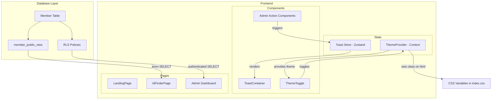

# Design Document: RLS, Toast, and Theme

## Overview

This design covers three interconnected features for the SBG Registration Portal:

1. **Row-Level Security (RLS) hardening** — Replace the current permissive SELECT policy with a Postgres VIEW that restricts both rows (approved-only) and columns (no sensitive data) for anonymous access.
2. **Toast notification system** — A Zustand-based toast store and React component that provides transient feedback after admin actions.
3. **Dark/Light theme toggle** — A ThemeProvider context, CSS variable layer, and toggle component enabling class-based theme switching with localStorage persistence.

All three features share no runtime coupling but converge on the same UI surface (admin dashboard) and CSS variable layer.

## Architecture



### Design Decisions

| Decision | Rationale |
|---|---|
| Use a Postgres VIEW for column restriction | Supabase RLS restricts rows only, not columns. A VIEW with `GRANT SELECT` on specific columns is the idiomatic Postgres approach. |
| Zustand for toast state (not Context) | Matches existing store pattern (admin.ts). Zustand avoids re-rendering the entire tree on toast changes. |
| Class-based theme switching (`html.light`) | Avoids CSS-in-JS. Tailwind and CSS variables respond to a single class toggle. No build-time theme generation needed. |
| CSS variables in `index.css` | Centralized token definitions. Components use `var(--color-*)` or mapped Tailwind utilities — no per-component overrides. |
| Toast max 5 with FIFO eviction | Prevents screen overflow. 5 is a reasonable limit for admin dashboards. Oldest toasts are least relevant. |
| localStorage for theme persistence | Simplest persistence for a per-device preference. No backend round-trip needed. |

## Components and Interfaces

### 1. Database: `member_public_view`

A Postgres VIEW exposing only the safe columns of the Member table, filtered to approved records:

```sql
CREATE OR REPLACE VIEW member_public_view AS
SELECT
  id,
  student_number,
  full_name,
  sbg_id,
  course,
  year_level,
  section,
  school_year,
  skills,
  sticker_id,
  status,
  created_at
FROM "Member"
WHERE status = 'approved';

-- Grant anon role SELECT on the view (not the base table)
GRANT SELECT ON member_public_view TO anon;

-- Revoke direct SELECT on Member for anon (authenticated keeps full access)
REVOKE SELECT ON "Member" FROM anon;
```

The `IdFinderPage` will query `member_public_view` instead of `Member` directly.

### 2. Toast Store (`frontend/src/store/toast.ts`)

```typescript
import { create } from 'zustand'

type ToastVariant = 'success' | 'error' | 'warning' | 'info'

interface Toast {
  id: string
  message: string
  variant: ToastVariant
  duration: number // ms
  createdAt: number
}

interface ToastState {
  toasts: Toast[]
  addToast: (message: string, variant: ToastVariant, duration?: number) => string
  dismissToast: (id: string) => void
  clearAll: () => void
}
```

**Invariant**: `toasts.length <= 5`. When a 6th toast is added, the oldest (lowest `createdAt`) is evicted.

**ID generation**: `crypto.randomUUID()` for uniqueness.

### 3. Toast Container (`frontend/src/components/ui/ToastContainer.tsx`)

- Renders a fixed-position container at `top-right`
- Maps over `toasts` array from the store
- Each toast renders with variant-specific styling
- Auto-dismiss via `setTimeout` using the toast's `duration`
- ARIA: container has `role="status"` and `aria-live="polite"`; error toasts override to `aria-live="assertive"`

### 4. ThemeProvider (`frontend/src/components/ThemeProvider.tsx`)

```typescript
import { createContext, useContext, useEffect, useState, type ReactNode } from 'react'

type Theme = 'dark' | 'light'

interface ThemeContextValue {
  theme: Theme
  toggleTheme: () => void
}

const ThemeContext = createContext<ThemeContextValue | undefined>(undefined)

export function useTheme(): ThemeContextValue
export function ThemeProvider({ children }: { children: ReactNode }): JSX.Element
```

**Initialization order**:
1. Read `localStorage.getItem('sbg-theme')`
2. If null, check `window.matchMedia('(prefers-color-scheme: light)').matches`
3. If no system preference detected, default to `'dark'`

**On theme change**:
- `document.documentElement.classList.toggle('light', theme === 'light')`
- `localStorage.setItem('sbg-theme', theme)`

### 5. ThemeToggle (`frontend/src/components/ui/ThemeToggle.tsx`)

```typescript
import { Sun, Moon } from 'lucide-react'
import { useTheme } from '../ThemeProvider'

export function ThemeToggle(): JSX.Element
```

- Renders `<Sun />` when current theme is dark (indicating "click to switch to light")
- Renders `<Moon />` when current theme is light
- `aria-label`: "Switch to light mode" / "Switch to dark mode"
- Placed in: `LandingPage` navbar, `AdminSidebar`

### 6. CSS Variable Layer (additions to `frontend/src/index.css`)

```css
:root {
  /* existing dark mode variables stay as defaults */
  --grid-stroke: white;
}

.light {
  --color-bg: #f8f9fc;
  --color-surface: #ffffff;
  --color-surface-raised: #f0f2f8;
  --color-border: rgba(0, 0, 0, 0.08);
  --color-border-subtle: rgba(0, 0, 0, 0.12);
  --color-text-primary: #0f1117;
  --color-text-secondary: #4b5563;
  --grid-stroke: #1a1f2e;
  color-scheme: light;
}

/* Theme transition */
html {
  transition: background-color 150ms ease, color 150ms ease;
}
body {
  background-color: var(--color-bg);
  color: var(--color-text-primary);
  transition: background-color 150ms ease, color 150ms ease;
}
```

The `.grid-bg` utility will be updated to use the `--grid-stroke` variable instead of hardcoded `white`.

### 7. Tailwind Config Extensions

Add semantic color utilities mapped to CSS variables:

```typescript
// tailwind.config.ts extend.colors
'page': 'var(--color-bg)',
'surface': 'var(--color-surface)',
'surface-raised': 'var(--color-surface-raised)',
'border-theme': 'var(--color-border)',
'text-primary': 'var(--color-text-primary)',
'text-secondary': 'var(--color-text-secondary)',
```

## Data Models

### Toast

| Field | Type | Description |
|---|---|---|
| `id` | `string` | UUID, unique identifier |
| `message` | `string` | Display text |
| `variant` | `'success' \| 'error' \| 'warning' \| 'info'` | Visual style and ARIA behavior |
| `duration` | `number` | Auto-dismiss timeout in ms (default 5000) |
| `createdAt` | `number` | `Date.now()` timestamp for ordering |

### Theme

| Field | Type | Storage |
|---|---|---|
| `theme` | `'dark' \| 'light'` | `localStorage['sbg-theme']` |

### member_public_view (columns exposed)

| Column | Type | Source |
|---|---|---|
| `id` | `uuid` | Member.id |
| `student_number` | `text` | Member.student_number |
| `full_name` | `text` | Member.full_name |
| `sbg_id` | `text` | Member.sbg_id |
| `course` | `text` | Member.course |
| `year_level` | `integer` | Member.year_level |
| `section` | `text` | Member.section |
| `school_year` | `text` | Member.school_year |
| `skills` | `text[]` | Member.skills |
| `sticker_id` | `text` | Member.sticker_id |
| `status` | `MemberStatus` | Member.status (always 'approved') |
| `created_at` | `timestamptz` | Member.created_at |

**Excluded columns**: `email`, `scholar_email`, `gender`, `why_join`, `expectations`, `cor_url`, `proof_of_share_url`, `updated_at`

## Correctness Properties

*A property is a characteristic or behavior that should hold true across all valid executions of a system — essentially, a formal statement about what the system should do. Properties serve as the bridge between human-readable specifications and machine-verifiable correctness guarantees.*

### Property 1: View column restriction

*For any* member record in the database (regardless of its data), querying `member_public_view` SHALL return only the columns in `ID_Lookup_Fields` (id, student_number, full_name, sbg_id, course, year_level, section, school_year, skills, sticker_id, status, created_at) and SHALL never include sensitive columns (email, scholar_email, cor_url, proof_of_share_url, gender, why_join, expectations).

**Validates: Requirements 1.1, 1.3, 1.4**

### Property 2: View row filtering

*For any* set of members with varying statuses, querying `member_public_view` SHALL return only rows where `status = 'approved'` — no pending, rejected, inactive, or removed records shall appear.

**Validates: Requirements 1.2**

### Property 3: Toast variant correctness

*For any* valid toast variant (success, error, warning, info) and any non-empty message string, calling `addToast(message, variant)` SHALL produce a toast object in the store with matching `message` and `variant` fields.

**Validates: Requirements 4.1**

### Property 4: Toast dismiss removes correct toast

*For any* set of active toasts and any valid toast ID within that set, calling `dismissToast(id)` SHALL remove only the toast with that ID and leave all other toasts unchanged.

**Validates: Requirements 4.3**

### Property 5: Toast max-5 newest invariant

*For any* sequence of N toast additions (where N > 5), the store SHALL contain at most 5 toasts, and those 5 SHALL be the most recently added (highest `createdAt` values). All older toasts SHALL be evicted.

**Validates: Requirements 4.4, 4.5**

### Property 6: Theme persistence round-trip

*For any* theme value ('dark' or 'light'), after `toggleTheme` sets the theme, reading `localStorage.getItem('sbg-theme')` SHALL return that same theme value (round-trip: set → read = identity).

**Validates: Requirements 7.1**

### Property 7: Theme DOM class synchronization

*For any* sequence of theme changes, the presence of the "light" class on `document.documentElement` SHALL equal `(currentTheme === 'light')` — the DOM class always reflects the current theme state.

**Validates: Requirements 7.4**

### Property 8: Theme toggle involution

*For any* initial theme state, calling `toggleTheme` twice SHALL return the theme to its original value (toggle is its own inverse).

**Validates: Requirements 8.2**

## Error Handling

### RLS / View Layer

| Scenario | Handling |
|---|---|
| Anon attempts SELECT on `Member` directly (after REVOKE) | Postgres returns permission denied error. Frontend already queries the view, so this is a defense-in-depth guard. |
| Anon attempts UPDATE/DELETE | RLS denies — no UPDATE/DELETE policies exist for anon. Supabase client returns `{ error }`. |
| View returns empty results | IdFinderPage shows "Not Found" state (existing behavior). |

### Toast System

| Scenario | Handling |
|---|---|
| Toast `addToast` called with empty message | Store ignores the call (no-op). |
| `dismissToast` called with non-existent ID | Store filters — no-op, no error thrown. |
| Timer fires after toast already dismissed | `dismissToast` is idempotent — no crash. |

### Theme System

| Scenario | Handling |
|---|---|
| `localStorage` is unavailable (private browsing) | Wrap in try/catch, fall back to in-memory state. Theme still works within the session. |
| Invalid value in `localStorage['sbg-theme']` | Treat as missing — fall through to system preference → dark default. |
| `matchMedia` not supported | Treat as no system preference — default to dark. |

## Testing Strategy

### Property-Based Tests (fast-check)

The project already has `fast-check` installed. Each correctness property maps to a single property-based test with minimum 100 iterations.

| Property | Test Target | Library |
|---|---|---|
| Property 1: View column restriction | SQL view output (mocked) | fast-check + vitest |
| Property 2: View row filtering | SQL view output (mocked) | fast-check + vitest |
| Property 3: Toast variant correctness | `useToastStore.addToast` | fast-check + vitest |
| Property 4: Toast dismiss removes correct toast | `useToastStore.dismissToast` | fast-check + vitest |
| Property 5: Toast max-5 invariant | `useToastStore.addToast` (bulk) | fast-check + vitest |
| Property 6: Theme persistence round-trip | ThemeProvider + localStorage mock | fast-check + vitest |
| Property 7: Theme DOM class sync | ThemeProvider + document mock | fast-check + vitest |
| Property 8: Theme toggle involution | ThemeProvider toggle | fast-check + vitest |

**Tag format**: `// Feature: rls-toast-theme, Property N: <title>`

**Configuration**: Each property test runs with `{ numRuns: 100 }`.

### Unit Tests (vitest + @testing-library/react)

- Toast component rendering (variant classes, ARIA attributes, dismiss button)
- ThemeToggle icon rendering (sun/moon) and aria-label correctness
- ThemeProvider initialization scenarios (localStorage exists, system preference, fallback)
- Toast auto-dismiss timing (fake timers)

### Integration Tests

- RLS policies: test anon INSERT allowed, anon UPDATE/DELETE denied
- Admin action → toast flow: mock action responses, verify correct toast variant triggered
- Authenticated full access: verify all columns returned when authenticated

### Smoke Tests

- Service role bypasses RLS (single execution)
- View exists and is queryable
