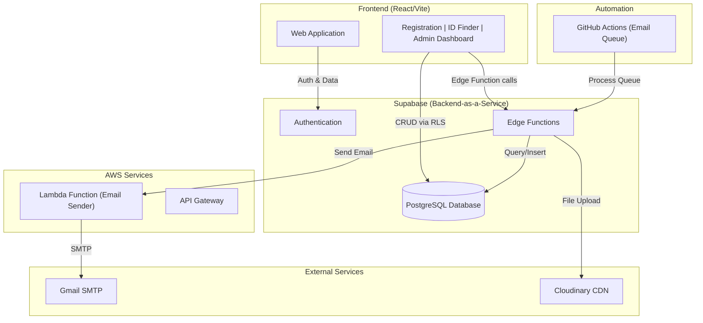

# SBG Membership & ID Management Portal

**Student Builder Group – PUP Biñan Campus**
A serverless, cloud-native membership portal for managing registrations, member approvals, and digital ID retrieval.

> This app is registration-focused: the root route (`/`) serves the membership application. The public marketing site lives as a separate project and links back here via its "Join as Member" button (see `VITE_MARKETING_URL`).

---

## Overview

The SBG Registration Portal is a comprehensive membership management system that handles:
- **Multi-step registration** with document uploads, source tracking, and validation
- **Returning member renewal** — streamlined re-registration with student number verification
- **Late COR submission** — applicants who registered without a COR can upload it later via `/submit-cor`
- **Semester management** — per-semester term resets with school year + semester tracking
- **Digital ID retrieval** for approved and inactive members (with QR code for event check-in)
- **Admin dashboard** — bulk approve/reject, CSV export, audit log, announcements
- **Automated email notifications** for registrations, approvals, and announcements
- **Data visualization** with member statistics and analytics

Built entirely serverless using **Supabase** backend and **React** frontend.

---

## Tech Stack

| Layer | Technology | Purpose |
|---|---|---|
| **Frontend** | React 18 + TypeScript + Vite | SPA with HMR |
| **Styling** | Tailwind CSS + PostCSS | Responsive UI |
| **State** | Zustand | Global state management |
| **Forms** | React Hook Form + Zod | Form validation |
| **Database** | Supabase (PostgreSQL) | Member data, email queue, feature flags |
| **Auth** | Supabase Auth (JWT) | Admin authentication |
| **Email** | AWS Lambda + Gmail SMTP | Transactional emails |
| **File Upload** | Cloudinary (CDN) | Document storage (signed uploads) |
| **Backend** | Supabase Edge Functions (Deno) | Serverless backend logic |
| **Automation** | GitHub Actions (Cron) | Email queue processor |
| **Charts** | Recharts | Admin analytics |
| **ID Export** | html-to-image + qrcode.react | Digital ID cards with QR |

---

## System Architecture



---

## Getting Started

### Prerequisites
- Node.js 20+ and npm
- Supabase CLI (`npm i -g supabase`)
- A Supabase project
- AWS Lambda function deployed (for emails)
- Gmail account with app password
- Cloudinary account

### 1. Clone and install

```bash
git clone <repository-url>
cd SBG-Registration/frontend
npm install
```

### 2. Configure environment

```bash
cp .env.example .env.local
```

Edit `.env.local` with your Supabase project credentials:

```env
VITE_SUPABASE_URL=https://<your-project>.supabase.co
VITE_SUPABASE_ANON_KEY=<your-anon-key>
VITE_APP_URL=http://localhost:5173
VITE_MARKETING_URL=https://<your-marketing-site>
```

### 3. Run development server

```bash
npm run dev
```

Visit http://localhost:5173

---

## Supabase Backend Setup

### Link your project

```bash
supabase link --project-id <your-project-id>
```

### Set secrets

Edit `supabase/set-secrets.sh` with your actual values, then:

```bash
chmod +x supabase/set-secrets.sh
./supabase/set-secrets.sh
```

Required secrets:
- `CLOUDINARY_CLOUD_NAME`, `CLOUDINARY_API_KEY`, `CLOUDINARY_API_SECRET`
- `GMAIL_ADDRESS`, `GMAIL_APP_PASSWORD`
- `LAMBDA_EMAIL_ENDPOINT`, `LAMBDA_API_KEY`
- `APP_URL`

### Deploy Edge Functions

```bash
supabase functions deploy register
supabase functions deploy submit-cor
supabase functions deploy approve
supabase functions deploy reject
supabase functions deploy send-announcement
supabase functions deploy send-approval-email
supabase functions deploy registration-confirmation
supabase functions deploy process-email-queue
supabase functions deploy term-reset
```

### Database setup

The database schema is managed via Supabase. Key tables:
- `Member` — student registrations and membership data (includes `heard_from` for source tracking)
- `EmailQueue` — queued emails with retry logic
- `SchoolYear` — academic year + semester tracking (1st/2nd)
- `AppConfig` — application-level feature flags (registration open/closed)
- `AuditLog` — admin action history (approvals, announcements, term resets)

> **Announcement targeting:** "All Members" sends only to approved members in the current active term. "Non-Renewed Members" targets inactive members from previous terms.

SQL migrations are in the `database/` directory (run them in order in the Supabase SQL Editor):
1. `schema.sql` — base tables
2. `001_app_config.sql` — feature flags
3. `002_rls_and_view.sql` — RLS policies + public view
4. `003_audit_log.sql` — audit log table
5. `004_semester_management.sql` — redesigned SchoolYear with semester support
6. `005_renewal_view.sql` — renewal verification view for returning members

---

## Email System

### How it works

1. **Trigger**: User action (register, approve, send announcement)
2. **Queue**: Email inserted into `EmailQueue` table with `status='pending'`
3. **Processing**: GitHub Actions cron runs every 1 minute
4. **Sending**: Edge function retrieves pending emails and calls AWS Lambda
5. **Lambda**: Connects via Gmail SMTP and sends email
6. **Update**: Queue status updated to `'sent'` or `'failed'`
7. **Retry**: Failed emails retry up to 3 times

### GitHub Actions setup

1. Add `SUPABASE_SERVICE_ROLE_KEY` to your repository's Actions secrets
2. The `.github/workflows/email-queue.yml` cron triggers every minute

> **Note**: GitHub Actions cron has no SLA on exact timing — jobs may be delayed by 1–5 minutes under load. This is acceptable for non-time-critical transactional emails.

---

## CI Pipeline

The `.github/workflows/ci.yml` runs on every PR and push to main:
- Lint (ESLint)
- Type check (TypeScript)
- Tests (Vitest)
- Build verification

---

## Project Structure

```
SBG-Registration/
├── frontend/                    # React + Vite SPA
│   ├── src/
│   │   ├── components/          # UI components by feature
│   │   │   ├── admin/           # Admin dashboard components
│   │   │   ├── registration/    # Registration + renewal forms
│   │   │   ├── id-card/         # Digital ID card with QR
│   │   │   └── ui/              # Reusable primitives
│   │   ├── pages/               # Route pages
│   │   ├── store/               # Zustand stores
│   │   ├── lib/                 # API helpers & utilities
│   │   └── types/               # TypeScript types
│   └── vite.config.ts
│
├── supabase/
│   ├── functions/               # Edge Functions (Deno)
│   └── set-secrets.sh           # Secrets deployment script
│
├── docs/                        # Project documentation
│   ├── ARCHITECTURE.md          # System design & data flows
│   ├── DATABASE.md              # Schema, migrations, RLS policies
│   ├── API.md                   # Edge Function & query reference
│   ├── ADMIN-GUIDE.md           # Admin dashboard usage guide
│   ├── DEVELOPER.md             # Setup & contribution guide
│   └── SECURITY.md              # Auth, RLS, known risks
│
├── lambda/
│   └── email-sender/            # Python Lambda (Gmail SMTP)
│
└── .github/workflows/
    ├── email-queue.yml          # Email queue cron
    └── ci.yml                   # Lint, test, build
```

---

## Environment Variables

### Frontend (`frontend/.env.local`)

| Variable | Description |
|---|---|
| `VITE_SUPABASE_URL` | Supabase project URL |
| `VITE_SUPABASE_ANON_KEY` | Supabase anonymous/public key |
| `VITE_APP_URL` | Frontend deployment URL |
| `VITE_MARKETING_URL` | Main marketing site URL (used by "Back to site" links; falls back to `/`) |

### Supabase Secrets

| Secret | Description |
|---|---|
| `CLOUDINARY_CLOUD_NAME` | Cloudinary account name |
| `CLOUDINARY_API_KEY` | Cloudinary API key |
| `CLOUDINARY_API_SECRET` | Cloudinary API secret |
| `GMAIL_ADDRESS` | Gmail sender address |
| `GMAIL_APP_PASSWORD` | Gmail app password (16-char token) |
| `LAMBDA_EMAIL_ENDPOINT` | AWS API Gateway URL for email Lambda |
| `LAMBDA_API_KEY` | API key for Lambda endpoint |
| `APP_URL` | Frontend URL (used in email links) |

### GitHub Actions Secrets

| Secret | Description |
|---|---|
| `SUPABASE_SERVICE_ROLE_KEY` | Elevated key for email queue processing |

> **Never commit actual secret values.** Use `.env.example` as a template.

---

## Troubleshooting

### Emails not sending?
1. Check `EmailQueue` table for failed entries: `SELECT * FROM "EmailQueue" WHERE status='failed'`
2. Verify Lambda function has correct Gmail credentials
3. Check GitHub Actions logs for cron job execution
4. Ensure `SUPABASE_SERVICE_ROLE_KEY` is set in GitHub Secrets

### File upload failing?
1. Verify Cloudinary credentials in Supabase Secrets
2. Check SHA-1 signature calculation in the register function
3. Ensure file MIME type is `image/jpeg`, `image/png`, or `application/pdf`

### Admin dashboard not loading?
1. Verify Supabase Auth session is valid
2. Check browser console for CORS errors
3. Ensure admin user exists in Supabase Auth

---

## Roadmap

### Event Management (Planned)

A lightweight event system for organizing SBG meetups, workshops, and community events.

**How it works:**
1. Admin creates an event (title, date, venue, description, capacity)
2. Approved members can RSVP / register for the event
3. Upon registration approval, member receives a unique **QR code** via email
4. At the event, admin scans QR codes for check-in
5. Admin can view and export the **attendee list** (CSV with name, student number, check-in time)

**Planned features:**
- Event creation and management in the admin dashboard
- Member-facing event list with RSVP button
- QR code generation per attendee (unique, scannable)
- QR-based check-in (admin scans via camera or manual code entry)
- Attendee list with real-time check-in status
- CSV export of attendees (name, student number, course, check-in timestamp)
- Event capacity tracking and waitlist

### Official Club Website (Separate Project)

The public marketing site (home, about, events, learn) is built and deployed as a **separate project** on its own domain. This portal stays lean and focused on registration, ID retrieval, and admin.

**Integration:** the marketing site's "Join as Member" button links to this app. This app's "Back to site" links point to the marketing site via `VITE_MARKETING_URL`.

**This portal serves:**
- `/` — Membership registration (new + returning)
- `/id-finder` — Digital ID lookup
- `/submit-cor` — Late COR submission
- `/[admin-path]/*` — Admin dashboard (hidden)

---

## License

This project is part of the Student Builder Group initiative at PUP Biñan Campus.
