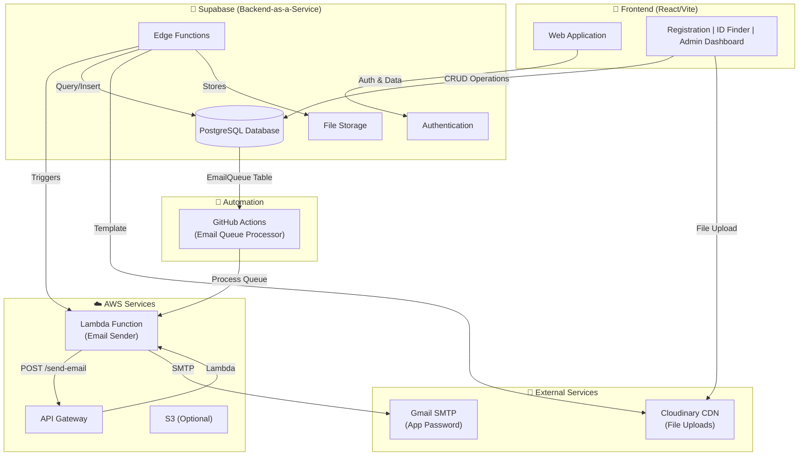
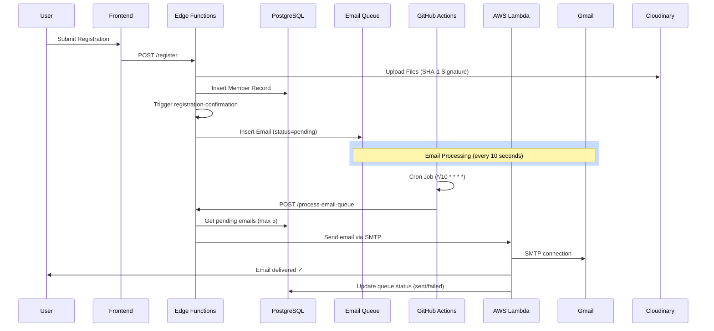

# SBG Membership & ID Management Portal

**Student Builder Group – PUP Biñan Campus**  
A serverless, cloud-native membership portal for managing registrations, member approvals, and digital ID retrieval.

---

## 📋 Overview

The SBG Registration Portal is a comprehensive membership management system that handles:
- **Multi-step registration** with document uploads and validation
- **Digital ID retrieval** for approved members
- **Admin dashboard** for review, approval, and member management
- **Automated email notifications** for registrations, approvals, and announcements
- **Data visualization** with member statistics and analytics

Built entirely serverless using **Supabase** backend and **React** frontend, deployed on **AWS** infrastructure.

---

## 🏗️ System Architecture



### Data Flow Diagram



---

## 🛠️ Tech Stack

| Layer | Technology | Purpose |
|---|---|---|
| **Frontend** | React 18 + TypeScript + Vite | SPA with HMR |
| **Styling** | Tailwind CSS + PostCSS | Responsive UI |
| **State Management** | Zustand | Global state |
| **Forms** | React Hook Form + Zod | Form validation |
| **Database** | Supabase (PostgreSQL) | Member data, email queue |
| **Auth** | Supabase Auth (JWT) | Admin authentication |
| **Email** | AWS Lambda + Gmail SMTP | Transactional emails |
| **File Upload** | Cloudinary (CDN) | Document storage |
| **Edge Computing** | Supabase Edge Functions (Deno) | Backend logic |
| **Automation** | GitHub Actions (Cron) | Email queue processor |
| **Charts** | Recharts | Admin analytics |
| **ID Export** | html-to-image + jsPDF | Digital ID cards |

---

## ☁️ Cloud Architecture

### **Supabase (Backend Platform)**
- **PostgreSQL Database**: Stores members, applications, email queue
- **Edge Functions**: TypeScript/Deno serverless runtime
  - `register/` — Handle new registrations + file uploads
  - `send-announcement/` — Queue announcement emails
  - `registration-confirmation/` — Trigger on member creation
  - `send-approval-email/` — Trigger on approval
  - `process-email-queue/` — Batch process pending emails
  - `approve/` / `reject/` — Admin actions
- **Authentication**: JWT-based with built-in session management
- **File Storage**: Direct Cloudinary integration for secure uploads

### **AWS Lambda & API Gateway**
- **Lambda Function**: `email-sender` (Python)
  - Receives email requests via API Gateway
  - Connects to Gmail SMTP server (smtp.gmail.com:465)
  - Sends emails with AWS VPC timeout (900s)
  - Returns success/error to Edge Function
- **API Gateway**: POST /send-email endpoint with API key protection
- **Secrets Manager** (optional): Store Gmail credentials

### **Cloudinary (File CDN)**
- Secure signed uploads with SHA-1 signatures
- Automatic image optimization and delivery
- Support for images, PDFs, and documents
- Public URLs for member file retrieval

### **GitHub Actions (Automation)**
- Cron job: `*/10 * * * *` (every 10 seconds)
- Calls `process-email-queue` edge function
- Uses Supabase service role key for elevated permissions
- Processes max 5 emails per execution to prevent overload

### **Gmail SMTP**
- Standard SMTP authentication with **App Password** (16-char token)
- No Google Cloud Platform setup required
- Throttles to prevent rate limits
- Used by Lambda function for message sending

---

## 📊 Database Schema

```sql
-- Members table
CREATE TABLE "Member" (
  id UUID PRIMARY KEY,
  student_number VARCHAR UNIQUE NOT NULL,
  full_name VARCHAR NOT NULL,
  email VARCHAR NOT NULL,
  course VARCHAR,
  year_level INTEGER,
  technical_interests TEXT[] DEFAULT '{}',
  status ENUM('pending', 'approved', 'rejected') DEFAULT 'pending',
  resume_url VARCHAR,
  id_photo_url VARCHAR,
  created_at TIMESTAMP DEFAULT NOW()
);

-- Email queue for batch processing
CREATE TABLE "EmailQueue" (
  id UUID PRIMARY KEY,
  to VARCHAR NOT NULL,
  subject VARCHAR NOT NULL,
  html TEXT NOT NULL,
  from_email VARCHAR NOT NULL,
  status ENUM('pending', 'sent', 'failed') DEFAULT 'pending',
  error TEXT,
  retry_count INTEGER DEFAULT 0,
  max_retries INTEGER DEFAULT 3,
  created_at TIMESTAMP DEFAULT NOW(),
  sent_at TIMESTAMP,
  updated_at TIMESTAMP DEFAULT NOW()
);

-- Indexes for performance
CREATE INDEX idx_email_queue_status ON "EmailQueue"(status);
CREATE INDEX idx_email_queue_created_at ON "EmailQueue"(created_at);
CREATE INDEX idx_member_status ON "Member"(status);
```

---

## 🔐 Authentication & Security

### Frontend
- JWT tokens stored in secure HTTP-only cookies (Supabase Auth)
- Protected routes with token validation
- Admin-only pages behind authentication gate

### Backend
- Edge Functions validate bearer tokens before processing
- Service role key used only in GitHub Actions (restricted secrets)
- Cloudinary uploads require signed SHA-1 signatures
- AWS Lambda API key required for email sending
- Rate limiting on public endpoints (10 announcements/IP/hour)

### Email Security
- Gmail app password (16-char token) ≠ actual Gmail password
- No credentials stored in Deno runtime
- Secrets stored in Supabase Secrets Manager
- Lambda has isolated execution environment

---

## 📧 Email System

### Email Processing Flow
1. **Trigger**: User action (register, approve, send announcement)
2. **Queue**: Email inserted into `EmailQueue` table with `status='pending'`
3. **Processing**: GitHub Actions runs every 10 seconds
4. **Sending**: Edge function retrieves pending emails and calls Lambda
5. **Lambda**: Connects via SMTP and sends email
6. **Update**: Queue status updated to `'sent'` or `'failed'`
7. **Retry**: Failed emails retry up to 3 times

### Email Templates
All emails use consistent template with:
- **Header Image**: Cloudinary-hosted SBG branding
- **Recipient Name**: Personalized greeting
- **Body Content**: Custom message per email type
- **Signature**: SBG footer with contact info
- **Footer Image**: Cloudinary-hosted SBG footer

---

## Getting Started

### Prerequisites
- Node.js 18+ and npm
- Supabase project
- AWS Lambda function deployed
- Gmail account with app password
- Cloudinary account

### 1. Clone the repository

```bash
git clone <repository-url>
cd SBG-Registration/frontend
```

### 2. Create environment file

Copy the template:
```bash
cp .env.example .env.local
```

Or create `.env.local` manually with the values from `.env.example`

### 3. Install dependencies

```bash
npm install
```

### 4. Run development server

```bash
npm run dev
```

Visit http://localhost:5173

---

## Supabase Backend Setup

For backend development or deployment:

```bash
# Initialize Supabase (if not already done)
supabase init

# Link to your Supabase project
supabase link --project-id [your-project-id]

# Set environment secrets
./supabase/set-secrets.sh

# Deploy edge functions
supabase functions deploy register send-announcement process-email-queue \
  registration-confirmation send-approval-email
```

### 5. Create EmailQueue table

In Supabase Dashboard → SQL Editor, run:

```sql
CREATE TYPE "EmailQueueStatus" AS ENUM ('pending', 'sent', 'failed');

CREATE TABLE "EmailQueue" (
  id UUID DEFAULT gen_random_uuid() PRIMARY KEY,
  to TEXT NOT NULL,
  subject TEXT NOT NULL,
  html TEXT NOT NULL,
  from_email TEXT NOT NULL,
  status "EmailQueueStatus" DEFAULT 'pending',
  error TEXT,
  retry_count INTEGER DEFAULT 0,
  max_retries INTEGER DEFAULT 3,
  created_at TIMESTAMP DEFAULT NOW(),
  sent_at TIMESTAMP,
  updated_at TIMESTAMP DEFAULT NOW()
);

CREATE INDEX idx_email_queue_status ON "EmailQueue"(status);
CREATE INDEX idx_email_queue_created_at ON "EmailQueue"(created_at DESC);
```

### 6. Set up GitHub Actions

1. Commit `.github/workflows/email-queue.yml` to your repository
2. Add `SUPABASE_SERVICE_ROLE_KEY` secret to GitHub repository settings
3. GitHub Actions will automatically process emails every 10 seconds

### 7. Run development server

```bash
npm run dev
```

Open [http://localhost:5173](http://localhost:5173)

---

## 📍 Project Structure

```
SBG-Registration/
├── frontend/                    # React + Vite SPA
│   ├── src/
│   │   ├── components/
│   │   │   ├── admin/           # Admin dashboard components
│   │   │   ├── registration/    # Registration form
│   │   │   ├── id-card/         # Digital ID card
│   │   │   └── ui/              # Reusable UI components
│   │   ├── pages/               # Route pages
│   │   ├── store/               # Zustand state management
│   │   ├── lib/                 # Utilities & API helpers
│   │   └── types/               # TypeScript types
│   └── vite.config.ts
│
├── supabase/
│   ├── functions/
│   │   ├── register/            # Handle new registrations
│   │   ├── send-announcement/   # Queue announcements
│   │   ├── registration-confirmation/  # Confirm registration email
│   │   ├── send-approval-email/        # Approval email
│   │   ├── process-email-queue/        # Batch email processor
│   │   ├── approve/              # Approve applicant
│   │   ├── reject/               # Reject applicant
│   │   └── _shared/              # Shared utilities
│   │       ├── emailTemplate.ts  # Email HTML template
│   │       └── rateLimiter.ts    # Rate limiting
│   └── set-secrets.sh            # Deploy secrets script
│
├── lambda/
│   └── email-sender/             # Python Lambda function
│       ├── lambda_function.py
│       └── requirements.txt
│
├── prisma/
│   ├── schema.prisma             # Database schema
│   └── seed.sql                  # Sample data
│
└── .github/
    └── workflows/
        └── email-queue.yml       # GitHub Actions cron job
```

---

## 🔑 Environment Variables

### Frontend (`.env.local`)
```env
VITE_SUPABASE_URL=https://mkneaeisrwxnbahephay.supabase.co
VITE_SUPABASE_ANON_KEY=eyJ...
VITE_APP_URL=https://sbg-registration.app
```

### Supabase Secrets (via `set-secrets.sh`)
```
CLOUDINARY_CLOUD_NAME=dkue2jyea
CLOUDINARY_API_KEY=...
CLOUDINARY_API_SECRET=...
GMAIL_ADDRESS=sbg.pupbinan@gmail.com
GMAIL_APP_PASSWORD=qixk kmwx ejcs tqkn
LAMBDA_EMAIL_ENDPOINT=https://fjab67fcm2.execute-api.ap-southeast-1.amazonaws.com/prod/send-email
LAMBDA_API_KEY=...
APP_URL=https://sbg-registration.app
```

### GitHub Actions Secrets
```
SUPABASE_SERVICE_ROLE_KEY=eyJ...
```

---

## 🚢 Deployment

### Frontend Deployment (AWS Amplify)
```bash
amplify init
amplify add hosting
amplify publish
```

### Supabase Edge Functions
Functions auto-deploy when you run:
```bash
supabase functions deploy [function-name]
```

### AWS Lambda
```bash
cd lambda/email-sender
zip -r function.zip .
aws lambda update-function-code --function-name sbg-email-sender \
  --zip-file fileb://function.zip --region ap-southeast-1
```

---

## 📡 API Endpoints

### Edge Functions (Supabase)

#### Register Member
```
POST /functions/v1/register
Content-Type: multipart/form-data

Form Data:
- student_number: string
- full_name: string
- email: string
- course: string
- year_level: number
- technical_interests: string[]
- resume: File
- id_photo: File
```

#### Send Announcement
```
POST /functions/v1/send-announcement
Authorization: Bearer [JWT_TOKEN]
Content-Type: application/json

{
  "subject": "Community Announcement",
  "body": "Message content",
  "signature": "SBG Team",
  "recipients": {
    "type": "group",
    "filters": {
      "course": "BSCS",
      "year_level": 3,
      "status": "approved"
    }
  }
}
```

#### Send Approval Email
```
POST /functions/v1/send-approval-email
Authorization: Bearer [JWT_TOKEN]
Content-Type: application/json

{
  "memberId": "uuid-of-member"
}
```

#### Process Email Queue
```
POST /functions/v1/process-email-queue
Authorization: Bearer [SERVICE_ROLE_KEY]

# Automatically called by GitHub Actions every 10 seconds
```

---

## 🛠️ Troubleshooting

### Emails not sending?
1. Check `EmailQueue` table for pending emails: `SELECT * FROM "EmailQueue" WHERE status='failed'`
2. Verify Lambda function has correct Gmail credentials
3. Check GitHub Actions logs for cron job execution
4. Ensure SUPABASE_SERVICE_ROLE_KEY is set in GitHub Secrets

### File upload failing?
1. Verify Cloudinary credentials in Supabase Secrets
2. Check SHA-1 signature calculation in register function
3. Ensure file MIME type is supported

### Admin dashboard not loading?
1. Verify Supabase Auth JWT token is valid
2. Check browser console for CORS errors
3. Ensure admin user exists in Supabase Auth

### Lambda timeout?
1. Check AWS Lambda timeout setting (default: 3s, need 30-60s)
2. Verify Gmail SMTP connection from Lambda VPC
3. Check Lambda CloudWatch logs for errors

---

## 📞 Support

For issues or questions:
1. Check the [Troubleshooting](#troubleshooting) section
2. Review [Supabase Edge Functions docs](https://supabase.com/docs/guides/functions)
3. Review [AWS Lambda docs](https://docs.aws.amazon.com/lambda/)

---

## 📝 License

This project is part of the Student Builder Group initiative at PUP Biñan Campus.
