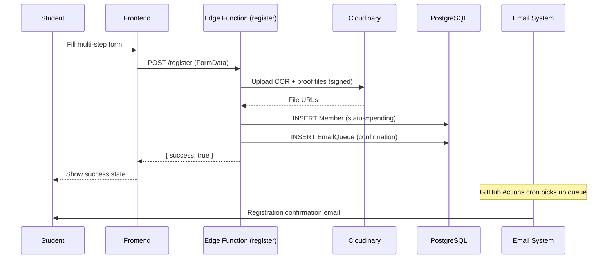
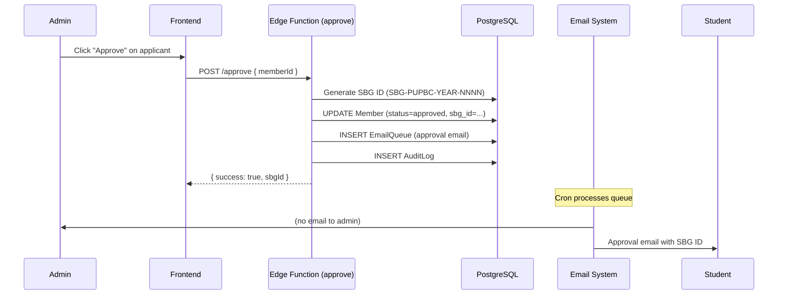
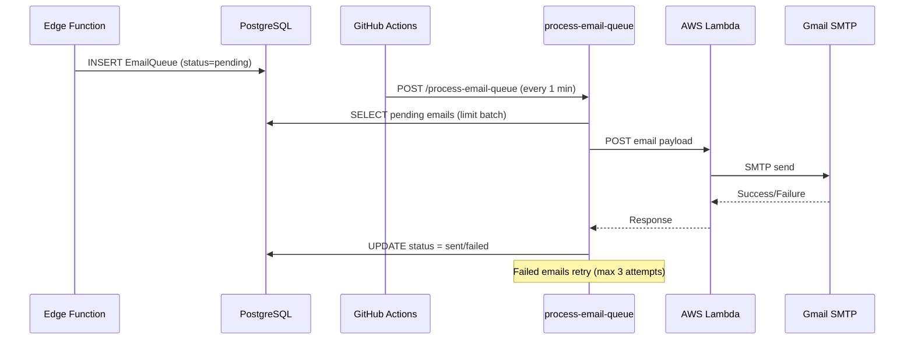
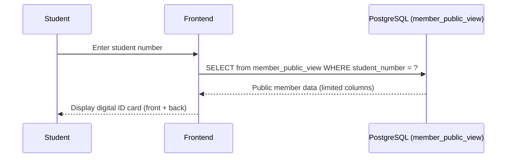
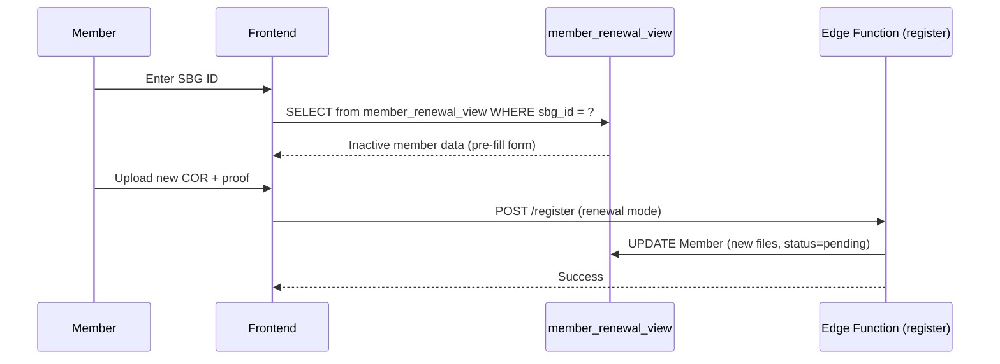

# System Architecture

## High-Level Overview

The SBG Registration Portal is a serverless, loosely coupled system built on Supabase (PostgreSQL + Edge Functions), a React SPA frontend, and external services for email delivery and file storage.

```mermaid
graph TB
    subgraph Client["Frontend (React SPA)"]
        Landing["Landing Page"]
        Register["Registration Form"]
        IdFinder["ID Finder"]
        Admin["Admin Dashboard"]
    end

    subgraph Supabase["Supabase Platform"]
        Auth["Supabase Auth (JWT)"]
        DB[(PostgreSQL + RLS)]
        Edge["Edge Functions (Deno)"]
    end

    subgraph External["External Services"]
        Cloudinary["Cloudinary CDN"]
        Lambda["AWS Lambda"]
        Gmail["Gmail SMTP"]
    end

    subgraph Automation["GitHub Actions"]
        Cron["Email Queue Cron (1 min)"]
        CI["CI Pipeline (lint/test/build)"]
        Ping["Keep-Alive Ping"]
    end

    Client -->|Direct queries (RLS)| DB
    Client -->|Login/Session| Auth
    Client -->|Mutations| Edge

    Edge -->|Service role queries| DB
    Edge -->|Signed uploads| Cloudinary
    Edge -->|Send email| Lambda
    Lambda -->|SMTP| Gmail

    Cron -->|POST /process-email-queue| Edge
```

---

## Component Breakdown

| Component | Technology | Responsibility |
|---|---|---|
| **Frontend** | React 18 + Vite + TypeScript | SPA with registration, ID lookup, admin dashboard |
| **Backend** | Supabase Edge Functions (Deno) | Serverless mutations requiring elevated permissions |
| **Database** | PostgreSQL (Supabase-hosted) | Member data, email queue, config, audit log |
| **Auth** | Supabase Auth (JWT) | Admin authentication, session management |
| **Email** | AWS Lambda (Python) + Gmail SMTP | Transactional email delivery |
| **File Storage** | Cloudinary | COR and proof-of-share document uploads |
| **Automation** | GitHub Actions | Email queue processing, CI, DB keep-alive |

---

## Data Flow Diagrams

### Registration Flow



### Approval Flow



### Email Sending Flow



### ID Lookup Flow



### Renewal Flow



---

## Security Model

| Layer | Mechanism | Purpose |
|---|---|---|
| **Row Level Security** | PostgreSQL RLS policies | Controls who can read/write each table |
| **Auth** | Supabase Auth (JWT tokens) | Admin identity verification |
| **Views** | `member_public_view`, `member_renewal_view` | Limit column exposure to anonymous users |
| **Admin path obscuring** | Build-time env var (`VITE_ADMIN_PATH`) | Admin routes hidden behind configurable URL path |
| **Build gating** | `VITE_ADMIN_ENABLED` flag | Admin code tree-shaken from production build if disabled |
| **Service role isolation** | Edge Functions use service role key | Elevated DB access never exposed to client |

---

## Loosely Coupled Design

Each component communicates through well-defined interfaces and can be swapped independently:

| Component | Interface | Swappable With |
|---|---|---|
| **Frontend** | Consumes Supabase client + Edge Function HTTP API | Any SPA framework (Vue, Svelte) — same API contracts |
| **Edge Functions** | HTTP POST endpoints with JSON request/response | Any serverless platform (Vercel, Cloudflare Workers) |
| **Database** | PostgreSQL with RLS + views | Any Postgres-compatible DB (Neon, CockroachDB) |
| **Email sender** | AWS Lambda behind API Gateway (POST with API key) | Any email service (SendGrid, Resend, SES) |
| **File storage** | Cloudinary signed upload API | Any CDN (S3 + CloudFront, Uploadthing) |
| **Automation** | GitHub Actions calling HTTP endpoints | Any cron service (Railway cron, AWS EventBridge) |

Communication between components:
- **Frontend ↔ Database**: Supabase JS client (PostgREST under the hood), filtered by RLS
- **Frontend ↔ Edge Functions**: HTTP POST with Bearer token (JWT or anon key)
- **Edge Functions ↔ Database**: Supabase service role client (bypasses RLS)
- **Edge Functions ↔ Lambda**: HTTP POST with API key header
- **GitHub Actions ↔ Edge Functions**: HTTP POST with service role key as Bearer token
