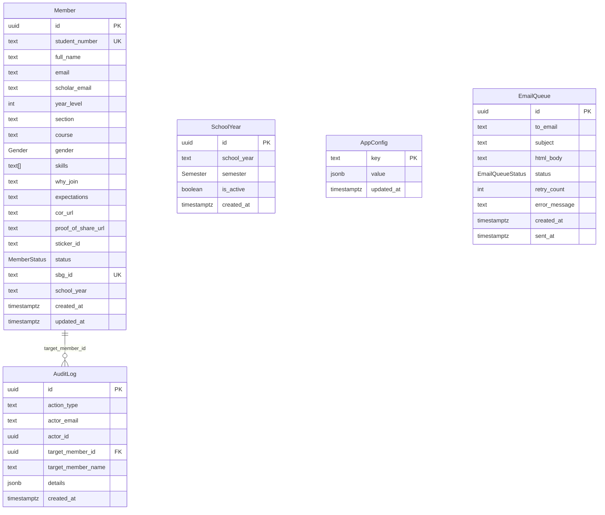

# Database Schema & Migrations

## Entity-Relationship Overview



---

## Tables

### Member

The core table storing all student registration data.

| Column | Type | Constraints | Description |
|---|---|---|---|
| `id` | UUID | PK, default `gen_random_uuid()` | Unique member identifier |
| `student_number` | TEXT | NOT NULL, UNIQUE | PUP student number |
| `full_name` | TEXT | NOT NULL | Full name |
| `email` | TEXT | NOT NULL | Personal email |
| `scholar_email` | TEXT | nullable | Institutional email |
| `year_level` | INTEGER | NOT NULL | Current year level (1-4) |
| `section` | TEXT | NOT NULL | Class section |
| `course` | TEXT | nullable | Degree program |
| `gender` | Gender | nullable | Gender identity |
| `skills` | TEXT[] | NOT NULL, default `{}` | Self-reported skills |
| `why_join` | TEXT | nullable | Motivation essay |
| `expectations` | TEXT | nullable | What they expect from SBG |
| `cor_url` | TEXT | nullable | Cloudinary URL for COR document |
| `proof_of_share_url` | TEXT | nullable | Cloudinary URL for share proof |
| `sticker_id` | TEXT | nullable | Digital sticker identifier |
| `status` | MemberStatus | NOT NULL, default `pending` | Application status |
| `sbg_id` | TEXT | UNIQUE, nullable | Assigned SBG ID (e.g., `SBG-PUPBC-2026-0042`) |
| `school_year` | TEXT | nullable | Academic term at registration |
| `created_at` | TIMESTAMPTZ | NOT NULL, default `now()` | Registration timestamp |
| `updated_at` | TIMESTAMPTZ | NOT NULL, default `now()` | Last modification (auto-updated via trigger) |

### EmailQueue

Queue-based email delivery with retry logic.

| Column | Type | Constraints | Description |
|---|---|---|---|
| `id` | UUID | PK | Email record ID |
| `to_email` | TEXT | NOT NULL | Recipient email address |
| `subject` | TEXT | NOT NULL | Email subject line |
| `html_body` | TEXT | NOT NULL | Full HTML email content |
| `status` | EmailQueueStatus | NOT NULL, default `pending` | Delivery status |
| `retry_count` | INTEGER | NOT NULL, default `0` | Number of send attempts |
| `error_message` | TEXT | nullable | Last error message on failure |
| `created_at` | TIMESTAMPTZ | NOT NULL, default `now()` | Queued timestamp |
| `sent_at` | TIMESTAMPTZ | nullable | Actual send timestamp |

### SchoolYear

Tracks academic terms with semester granularity.

| Column | Type | Constraints | Description |
|---|---|---|---|
| `id` | UUID | PK | Term record ID |
| `school_year` | TEXT | NOT NULL | Academic year (e.g., `2025-2026`) |
| `semester` | Semester | NOT NULL | `1st` or `2nd` |
| `is_active` | BOOLEAN | NOT NULL, default `false` | Whether this is the current term |
| `created_at` | TIMESTAMPTZ | NOT NULL, default `now()` | Creation timestamp |

**Unique constraint**: `(school_year, semester)` — prevents duplicate terms.

### AppConfig

Key-value store for application-level feature flags.

| Column | Type | Constraints | Description |
|---|---|---|---|
| `key` | TEXT | PK | Config key (e.g., `registration_open`) |
| `value` | JSONB | NOT NULL, default `true` | Config value |
| `updated_at` | TIMESTAMPTZ | NOT NULL, default `now()` | Last change timestamp |

### AuditLog

Immutable log of all admin actions.

| Column | Type | Constraints | Description |
|---|---|---|---|
| `id` | UUID | PK | Log entry ID |
| `action_type` | TEXT | NOT NULL | Action performed (approve, reject, etc.) |
| `actor_email` | TEXT | NOT NULL | Admin who performed the action |
| `actor_id` | UUID | NOT NULL | Auth user ID of the admin |
| `target_member_id` | UUID | FK → Member(id), ON DELETE SET NULL | Affected member (if applicable) |
| `target_member_name` | TEXT | nullable | Member name snapshot |
| `details` | JSONB | nullable | Additional context (bulk counts, email subjects, etc.) |
| `created_at` | TIMESTAMPTZ | NOT NULL, default `now()` | Action timestamp |

---

## Views

### member_public_view

Exposes limited member data for the **ID Finder** page. Accessible by anonymous users.

```sql
SELECT id, student_number, full_name, sbg_id, course, year_level,
       section, school_year, skills, sticker_id, status, created_at
FROM "Member"
WHERE status IN ('approved', 'inactive');
```

**Excludes**: email, scholar_email, gender, why_join, expectations, cor_url, proof_of_share_url, updated_at.

### member_renewal_view

Exposes inactive member data for the **Renewal** form. Accessible by anonymous users.

```sql
SELECT id, full_name, student_number, email, scholar_email, course,
       year_level, section, gender, skills, why_join, expectations, sbg_id, status
FROM "Member"
WHERE status = 'inactive' AND sbg_id IS NOT NULL;
```

---

## Enums

| Enum | Values | Usage |
|---|---|---|
| `MemberStatus` | `pending`, `approved`, `rejected`, `inactive`, `removed` | Member application lifecycle |
| `Gender` | `Male`, `Female`, `NonBinary`, `PreferNotToSay` | Self-reported gender identity |
| `Semester` | `1st`, `2nd` | Academic semester within a school year |
| `EmailQueueStatus` | `pending`, `sent`, `failed` | Email delivery state |

---

## RLS Policies Summary

### Member Table

| Policy | Role | Operation | Rule |
|---|---|---|---|
| Authenticated full read access | `authenticated` | SELECT | All rows |
| Anon insert for registration | `anon` | INSERT | Allowed (Edge Functions pass anon context) |
| _(no policy)_ | `anon` | UPDATE/DELETE | **Denied** (no policy = blocked) |
| _(service_role)_ | `service_role` | ALL | Bypasses RLS entirely |

**Direct SELECT on `Member` is revoked from `anon`** — they can only read through views.

### SchoolYear Table

| Policy | Role | Operation | Rule |
|---|---|---|---|
| Anyone can read school years | all | SELECT | All rows |
| Authenticated can insert | `authenticated` | INSERT | Allowed |
| Authenticated can update | `authenticated` | UPDATE | Allowed |

### AppConfig Table

| Policy | Role | Operation | Rule |
|---|---|---|---|
| Anyone can read app config | all | SELECT | All rows |
| Authenticated users can update | `authenticated` | UPDATE | Allowed |

### AuditLog Table

| Policy | Role | Operation | Rule |
|---|---|---|---|
| Authenticated users can insert | `authenticated` | INSERT | Allowed |
| Authenticated users can read | `authenticated` | SELECT | All rows |
| _(no policy)_ | `anon` | ALL | **Denied** |

---

## Indexes

| Index | Table | Column(s) | Purpose |
|---|---|---|---|
| `idx_member_student_number` | Member | `student_number` | Fast lookup for ID Finder and registration duplicate check |
| `idx_member_status` | Member | `status` | Filter by status (admin dashboard, views) |
| `idx_member_course` | Member | `course` | Analytics grouping by program |
| `idx_member_gender` | Member | `gender` | Analytics grouping by gender |
| `idx_audit_log_action_type` | AuditLog | `action_type` | Filter audit log by action |
| `idx_audit_log_created_at` | AuditLog | `created_at DESC` | Chronological audit log display |
| `idx_audit_log_actor` | AuditLog | `actor_id` | Filter by admin who acted |
| `idx_school_year_active` | SchoolYear | `is_active` (partial: WHERE true) | Quick lookup of current active term |

---

## Migration Order

Run these SQL files **in order** in the Supabase SQL Editor:

| # | File | Description |
|---|---|---|
| 1 | `schema.sql` | Base tables (Member, SchoolYear), enums, triggers, indexes |
| 2 | `001_app_config.sql` | AppConfig table + feature flags |
| 3 | `002_rls_and_view.sql` | RLS policies + member_public_view + permission grants |
| 4 | `003_audit_log.sql` | AuditLog table + RLS |
| 5 | `004_semester_management.sql` | Recreates SchoolYear with semester support |
| 6 | `005_renewal_view.sql` | member_renewal_view for returning members |

### How to Apply

1. Open your Supabase project dashboard → **SQL Editor**
2. Paste each file's contents in order
3. Click **Run** for each migration
4. Verify: check the Tables tab shows all expected tables and views

> **Note**: Migrations are additive and idempotent where possible (`CREATE OR REPLACE`, `IF NOT EXISTS`, `ON CONFLICT DO NOTHING`). However, `004_semester_management.sql` drops and recreates the SchoolYear table — only run this on a fresh setup or when migrating from the old schema.
